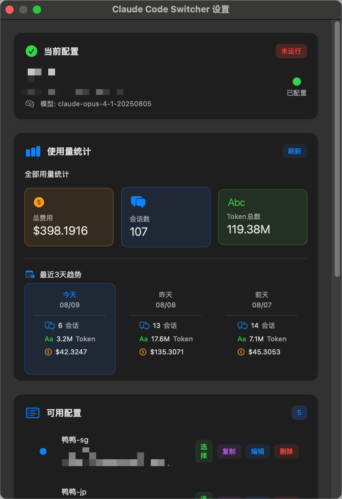
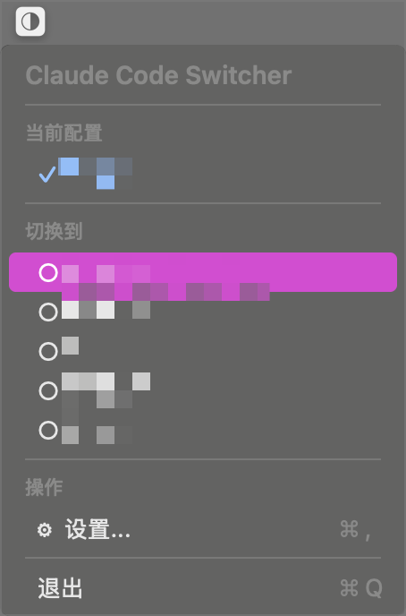

# Claude Code Switcher for macOS

<p align="center">
  
  
  
  
</p>

A lightweight macOS status bar application for managing and quickly switching between multiple Claude Code API provider configurations. Seamlessly integrates with Claude Code by automatically syncing to `~/.claude/settings.json`. Uses modern JSON file storage at `~/.config/ccs/claude-switch.json` for reliable configuration management.

## ✨ Features

- 🔄 **Quick Provider Switching** - Switch between different API providers with a single click from the status bar
- 🔀 **Local Proxy Mode** - Built-in HTTP proxy with automatic failover across multiple providers
- 📦 **Provider Grouping** - Organize providers into collapsible groups with priority sorting
- 💰 **Balance Checking** - View real-time API balance with available tokens, total granted, and usage stats
- 🎨 **Custom Provider Icons** - Set unique icons for each API provider for easy visual identification
- 📊 **Token Usage Statistics** - Track and visualize API token usage for the last 3 days with detailed breakdowns
- ⚙️ **Auto Configuration Sync** - Automatically syncs with Claude Code's settings.json
- 📁 **Modern Config Storage** - Uses `~/.config/ccs/claude-switch.json` for reliable configuration management
- 🔄 **Automatic Migration** - Seamlessly migrates from legacy UserDefaults storage
- 🌐 **Proxy Support** - Configure HTTP/HTTPS proxy settings per provider
- 🔔 **Switch Notifications** - Get notified when switching between providers
- 🎯 **Native macOS Experience** - Built with SwiftUI for a clean, modern interface

## 📸 Screenshots

<details>
<summary>View Screenshots</summary>

### Settings Window


### Status Bar Menu


</details>

## 🚀 Installation

### Option 1: Download Pre-built Release
1. Download the latest release from the [Releases](https://github.com/yourusername/MacOS-Claude-Code-Switcher/releases) page
2. Unzip the downloaded file
3. Move `ClaudeCodeSwitcher.app` to your Applications folder
4. Launch the app - it will appear in your status bar

### Option 2: Build from Source

#### Prerequisites
- macOS 12.0 (Monterey) or later
- Xcode 14.0 or later (or just Swift compiler)
- Swift 5.0 or later

#### Build Steps
```bash
# Clone the repository
git clone https://github.com/yourusername/MacOS-Claude-Code-Switcher.git
cd MacOS-Claude-Code-Switcher

# Build universal binary (Intel + Apple Silicon)
./build.sh

# Build specific architecture
./build.sh --intel    # Intel-only
./build.sh --arm      # Apple Silicon-only

# Or build all versions
./build-all.sh

# Alternative: Open in Xcode
open ClaudeCodeSwitcher.xcodeproj
# Press Cmd+B to build, Cmd+R to run
```

## 🎯 Usage

### Getting Started
1. **Launch the app** - The app icon will appear in your macOS status bar
2. **Add API Providers** - Click the status bar icon and select "Settings" to add your API providers
3. **Configure Providers** - For each provider, set:
   - Provider name
   - API Base URL
   - API Key
   - Default models
   - Custom icon (optional)
   - Proxy settings (optional)
4. **Switch Providers** - Click the status bar icon and select any provider to activate it

### Features in Detail

#### Local Proxy Mode (New!)
- Enable proxy mode to route all Claude Code requests through a local HTTP proxy
- Configure a **Proxy Pool** with multiple providers for automatic failover
- Health-based provider selection with penalty system:
  - Failed requests increase provider penalty (+10)
  - Successful requests slowly recover penalty (-1)
  - Providers sorted by (priority - penalty) score
- Automatic retry on errors: 401, 403, 429, and 5xx status codes
- Real-time status display: current provider, last success time
- Configurable port (default: 32000) and request timeout (10-600 seconds)

#### Provider Grouping
- Create custom groups to organize your providers
- Set priority for groups and providers within groups
- Collapsible groups in status bar menu for cleaner navigation
- Built-in "Proxy Pool" group for failover providers

#### Balance Checking
- Click "Refresh Balance" button in provider settings
- View real-time API balance information:
  - Available tokens remaining
  - Total granted tokens
  - Total used tokens
- Supports providers with `/api/usage/token` endpoint
- Automatic auth preservation for HTTP redirects

#### Custom Icons
- Right-click on any provider in settings
- Select "Set Custom Icon"
- Choose an image file (PNG, JPG, etc.)
- The icon will appear in the status bar when that provider is active

#### Token Usage Statistics
- Click "Usage Statistics" from the status bar menu
- View detailed token usage for the last 3 days
- See breakdown by model and date
- Track both prompt and completion tokens

#### Proxy Configuration
- In provider settings, expand "Advanced Options"
- Enter HTTP/HTTPS proxy URLs
- Proxy settings are applied per provider

## 🛠 Development

### Project Structure
```
MacOS-Claude-Code-Switcher/
├── App/                    # Application lifecycle and window management
├── Models/                 # Data models (APIProvider, ClaudeConfig)
├── Services/              # Business logic (ConfigManager, TokenStatistics, BalanceService)
├── Views/                 # SwiftUI views and UI components
├── Resources/             # Assets, icons, and Info.plist
└── build.sh               # Build script for universal binary
```

### Key Technologies
- **SwiftUI** - Modern declarative UI framework
- **AppKit** - Status bar integration (manual NSApplication lifecycle)
- **Network** - NWListener for local TCP proxy server
- **Combine** - Reactive programming for state management
- **JSON File Storage** - Modern configuration management at `~/.config/ccs/claude-switch.json`
- **Automatic Migration** - Seamless transition from UserDefaults to JSON
- **JSONEncoder/Decoder** - Claude settings synchronization
- **URLSessionTaskDelegate** - Auth-preserving HTTP redirect handling

### Building for Release
```bash
# Create a universal release build
./build.sh

# Verify architecture
lipo -info build/ClaudeCodeSwitcher.app/Contents/MacOS/ClaudeCodeSwitcher

# The built app will be in build/ClaudeCodeSwitcher.app
```

## 🤝 Contributing

Contributions are welcome! Please feel free to submit a Pull Request.

### How to Contribute
1. Fork the repository
2. Create your feature branch (`git checkout -b feature/AmazingFeature`)
3. Commit your changes (`git commit -m 'Add some AmazingFeature'`)
4. Push to the branch (`git push origin feature/AmazingFeature`)
5. Open a Pull Request

### Development Guidelines
- Follow Swift naming conventions and style guidelines
- Add tests for new features
- Update documentation as needed
- Ensure the app builds without warnings

## 📝 Requirements

- **macOS**: 12.0 (Monterey) or later
- **Storage**: ~10 MB
- **Claude Code**: Compatible with all versions that use `~/.claude/settings.json`

## 📁 Configuration File Management

### Config File Locations
- **App Configuration**: `~/.config/ccs/claude-switch.json`
- **Claude Configuration**: `~/.claude/settings.json`
- **Directory**: `~/.config/ccs/` (created automatically)

### Configuration Structure
The app stores all your API providers, settings, and preferences in a JSON file:
```json
{
  "providers": [
    {
      "id": "UUID",
      "name": "Provider Name",
      "url": "https://api.example.com",
      "key": "api-key-here",
      "largeModel": "model-name",
      "smallModel": "small-model-name",
      "groupName": "optional-group-name",
      "priority": 0
    }
  ],
  "providerGroups": [
    {
      "id": "UUID",
      "name": "Group Name",
      "priority": 0,
      "isBuiltin": false,
      "providerRefs": []
    }
  ],
  "currentProvider": {...},
  "autoUpdate": true,
  "proxyHost": "",
  "proxyPort": "",
  "proxyModeEnabled": false,
  "proxyModePort": 32000,
  "proxyRequestTimeout": 120
}
```

### Backup and Restore
- **Automatic Backup**: The app automatically creates atomic backups during updates
- **Manual Backup**: Copy `~/.config/ccs/claude-switch.json` to backup your configuration
- **Restore**: Replace the config file with your backup and restart the app
- **Migration**: Automatically migrates from older UserDefaults-based storage

### Security Features
- **File Permissions**: Config files are set to 600 (user read/write only)
- **Atomic Writes**: Prevents corruption during configuration updates
- **Fallback Storage**: UserDefaults as backup if file operations fail

## 🔧 Troubleshooting

### App doesn't appear in status bar
- Check if the app is running in Activity Monitor
- Try restarting the app
- Ensure you have granted necessary permissions

### Balance checking not working
- Verify your provider supports the `/api/usage/token` endpoint
- Check that your API key has permission to access usage data
- Ensure the base URL is correct (should not include `/api/usage/token`)
- If using a proxy, verify proxy settings are correct
- Check for HTTP redirects - the app handles them automatically

### Configuration not syncing with Claude Code
- Verify `~/.claude/settings.json` exists
- Check `~/.config/ccs/claude-switch.json` exists and contains your providers
- Check file permissions (should be 600 for config files)
- Restart both Claude Code Switcher and Claude Code

### Proxy mode not working
- Ensure proxy mode is enabled in settings
- Check that the proxy pool has at least one provider
- Verify the proxy port (default: 32000) is not in use by another application
- Check console logs for `[Proxy]` messages for debugging
- If all providers fail, check their API keys and URLs individually

### Configuration file not created
- The app only creates config files when you add providers or change settings
- Add at least one API provider to trigger config file creation
- Check that `~/.config/ccs/` directory exists
- Ensure you have write permissions to `~/.config/`

### Migration issues from UserDefaults
- First run automatically migrates existing UserDefaults configurations
- If migration fails, the app uses UserDefaults as fallback
- Check console logs for migration error messages
- Manual backup: Copy your providers before major updates

### Custom icons not displaying
- Ensure image files are in supported formats (PNG, JPG, HEIC)
- Try using smaller image files (< 1MB recommended)
- Reset the icon and set it again

## 📄 License

This project is licensed under the MIT License - see the [LICENSE](LICENSE) file for details.

## 🙏 Acknowledgments

- Built for the [Claude Code](https://claude.ai/code) community
- Inspired by the need for quick API provider switching
- Thanks to all contributors and users

## 📮 Contact & Support

- **Issues**: [GitHub Issues](https://github.com/yourusername/MacOS-Claude-Code-Switcher/issues)
- **Discussions**: [GitHub Discussions](https://github.com/yourusername/MacOS-Claude-Code-Switcher/discussions)

---

<p align="center">
  Made with ❤️ for the Claude Code community
</p>